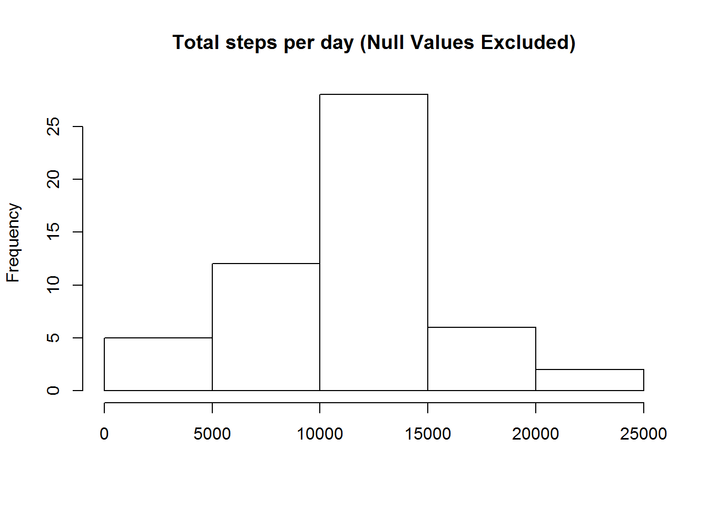
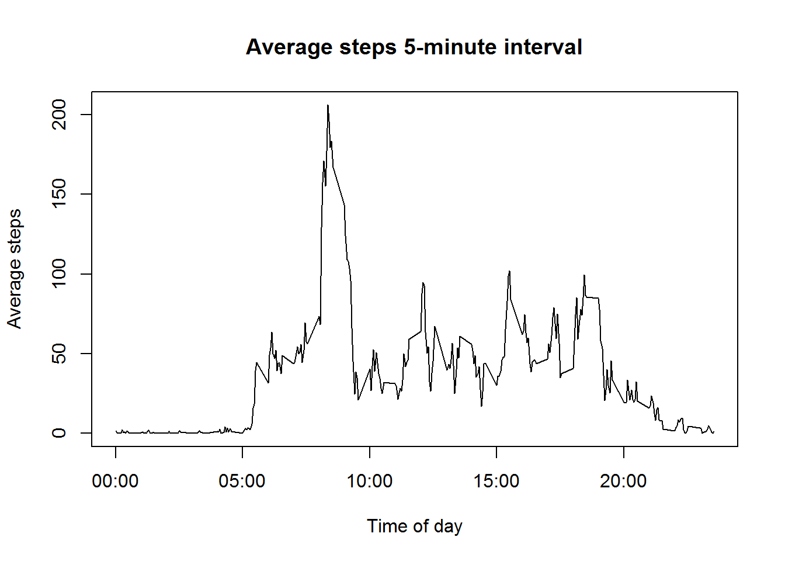
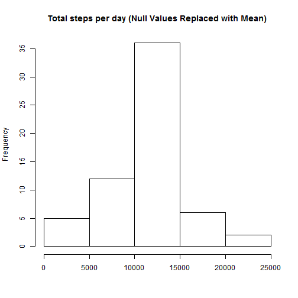
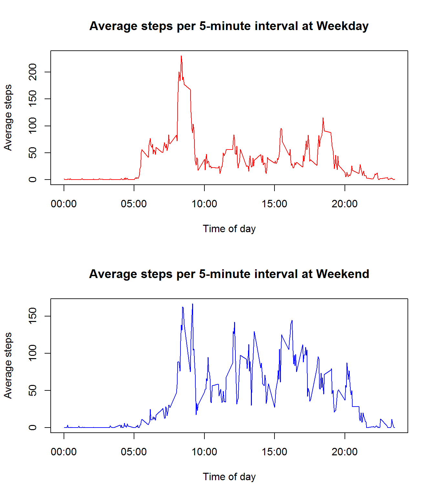
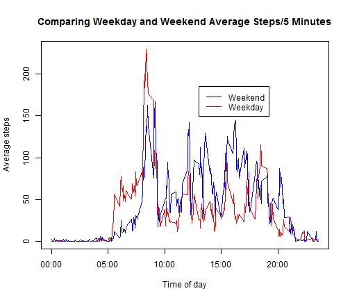

Reproducible Research: Peer Assessment 1
==========================================
## Coursera - Reproducible Research Stream 005

##Student:  Tony Davidson

Basic settings

Set the working directory

```r
setwd("~/GitHub/RepData_PeerAssessment1")
```

Load required libraries and set knitr and markdown options.

```r
require(dplyr)
require(knitr)
require(rmarkdown)
opts_chunk$set(fig.path="figures/")
opts_chunk$set(echo = TRUE) # Always make code visible
opts_chunk$set(results = "asis") # Always show results and graphs
options(scipen = 1) # Turn off scientific notations for numbers
```
## Loading and preprocessing the data
This assignment makes use of data from a personal activity monitoring device. This device collects data at 5 minute intervals through out the day. The data consists of two months of data from an anonymous individual collected during the months of October and November, 2012 and include the number of steps taken in 5 minute intervals each day.
Data

The data for this assignment can be downloaded from the course web site:

    Dataset: Activity monitoring data [52K]

The variables included in this dataset are:

    steps: Number of steps taking in a 5-minute interval (missing values are coded as NA)

    date: The date on which the measurement was taken in YYYY-MM-DD format

    interval: Identifier for the 5-minute interval in which measurement was taken

The dataset is stored in a comma-separated-value (CSV) file and there are a total of 17,568 observations in this dataset.

Note: The data use in the analysis was downloded from "https://d396qusza40orc.cloudfront.net/repdata%2Fdata%2Factivity.zip" on August 8, 2014 at 5:25 pm GMT +8 hrs

Load and clean the data by removing NA values.

```r
unzip("activity.zip")
activity <- read.csv("activity.csv", colClasses = c("integer", "Date", "factor"))
activity$month <- as.numeric(format(activity$date, "%m"))
activitynoNA <- na.omit(activity)
rownames(activitynoNA) <- 1:nrow(activitynoNA)
dim(activitynoNA)
```

[1] 15264     4

## What is the mean total number of steps taken per day?

Create a dataset with the total number of steps taken per day.

```r
steps_per_day <- activitynoNA %.% group_by(date) %.% summarise(total_steps = sum(steps))
```
Make a histogram of the total number of steps taken each day.

```r
with(steps_per_day, hist(total_steps, main = "Total steps per day (Null Values Excluded)", xlab = ""))
```

 

Calculate and report the mean and median total number of steps taken per day.

```r
with(steps_per_day, summary(total_steps))
```

   Min. 1st Qu.  Median    Mean 3rd Qu.    Max. 
     41    8840   10800   10800   13300   21200 

## What is the average daily activity pattern?
Create a dataset with the average number of steps taken per 5-minute interval,
averaged across all days (y-axis)

```r
average_daily_activity <- activitynoNA %.% group_by(interval) %.% summarise(average_activity = mean(steps))
```
Make a time series plot of the 5-minute interval (x-axis) and the average
number of steps taken, averaged across all days (y-axis)

```r
activitynoNA$interval <- as.factor(as.character(activitynoNA$interval))
interval.mean <- as.numeric(tapply(activitynoNA$steps, activitynoNA$interval, mean, na.rm = TRUE))
intervals <- data.frame(intervals = as.numeric(levels(activitynoNA$interval)), interval.mean)
intervals <- intervals[order(intervals$intervals), ]

labels <- c("00:00", "05:00", "10:00", "15:00", "20:00")
labels.at <- seq(0, 2000, 500)
plot(intervals$intervals, intervals$interval.mean, type = "l", main = "Average steps per 5-minute interval", 
    ylab = "Average steps", xlab = "Time of day", xaxt = "n")
axis(side = 1, at = labels.at, labels = labels)
```

 

Which 5-minute interval, on average across all the days in the dataset, contains
the maximum number of steps?

```r
interval_with_max_activity <- average_daily_activity %.% arrange(desc(average_activity)) %.% head(1)
interval_with_max_activity
```

Source: local data frame [1 x 2]

  interval average_activity
1      835            206.2

The 5-minute interval, on average across all the days in the dataset, with the
maximum number of steps is **835**.

## Imputing missing values
There are a number of days/intervals where there are missing values (coded as NA).
The presence of missing days may introduce bias into some calculations or summaries
of the data.
This is calculated and reported using the total number of missing values in the dataset
(i.e. the total number of rows with NAs)

```r
total_number_missing <- sum(!complete.cases(activity), na.rm=TRUE)
total_number_missing
```

[1] 2304
The total number of missing values in the dataset is 2304.
Create a new dataset that is equal to the original dataset but with the missing data filled in
with average steps for that 5-minute interval.

```r
activity_with_mean_steps_added <- left_join(activity, average_daily_activity)
```

```
## Joining by: "interval"
```

```r
activity_corrected <- activity_with_mean_steps_added[,c(1,2,3)]
for (i in 1:nrow(activity_corrected))
if (is.na(activity_corrected[i,1])) activity_corrected[i,1] <- activity_with_mean_steps_added[i,4]
```

Create a dataset with the average number of steps taken per 5-minute interval,
averaged across all days (y-axis), using the original dataset with missing data filled.

```r
avgSteps <- aggregate(activitynoNA$steps, list(interval = as.numeric(as.character(activitynoNA$interval))), FUN = "mean")
names(avgSteps)[2] <- "meanOfSteps"
activity_corrected <- activity
for (i in 1:nrow(activity_corrected)) {
if (is.na(activity_corrected$steps[i])) {
activity_corrected$steps[i] <- avgSteps[which(activity_corrected$interval[i] == avgSteps$interval), ]$meanOfSteps
}
}

steps_per_day_corrected <- activity_corrected %.% group_by(date) %.% summarise(total_steps = sum(steps))
```
Make a histogram of the total number of steps taken each day, using the original
dataset including the imputed missing data.

```r
with(steps_per_day_corrected, hist(total_steps, main = "Total steps per day (Null Values Replaced with Mean)", xlab = ""))
```

 


Calculate and report the mean and median total number of steps taken per day, using the original dataset with missing data filled.


```r
with(steps_per_day_corrected, summary(total_steps))
```

   Min. 1st Qu.  Median    Mean 3rd Qu.    Max. 
     41    9820   10800   10800   12800   21200 

As there is **no difference** in the results, it does not matter whether the missing data is excluded or imputed.

## Are there differences in activity patterns between weekdays and weekends?

```r
activity_corrected$day.type <- c("weekend", "weekday", "weekday", 
    "weekday", "weekday", "weekday", "weekend")[as.POSIXlt(activity_corrected$date)$wday + 
    1]
activity_corrected$day.type <- as.factor(activity_corrected$day.type)

weekday <- activity_corrected[activity_corrected$day.type == 
    "weekday", ]
weekend <- activity_corrected[activity_corrected$day.type == 
    "weekend", ]
weekday.means <- as.numeric(tapply(weekday$steps, weekday$interval, mean))
weekend.means <- as.numeric(tapply(weekend$steps, weekend$interval, mean))

intervals.day.type <- data.frame(intervals = as.numeric(levels(activity$interval)), 
    weekday.means, weekend.means)
intervals.day.type <- intervals.day.type[order(intervals.day.type$intervals), 
    ]
```
Plot two time series - weekdays and weekends - of the 5-minute intervals and average number of steps taken.


```r
par <- par(mfrow = c(2, 1))
plot(intervals.day.type$intervals, intervals.day.type$weekday.means, type = "l", 
    col = "red", ylab = "Average steps", xlab = "Time of day", main = "Average steps per 5-minute interval at Weekday", 
    xaxt = "n")
axis(side = 1, at = labels.at, labels = labels)
plot(intervals.day.type$intervals, intervals.day.type$weekend.means, type = "l", 
    col = "blue", ylab = "Average steps", xlab = "Time of day", main = "Average steps per 5-minute interval at Weekend", 
    xaxt = "n")
axis(side = 1, at = labels.at, labels = labels)
```

 

It is a bit difficult to compare the two plots. For a better comparison, combine the time series on a single plot.


```r
plot(intervals.day.type$intervals, intervals.day.type$weekday.means, type = "l", 
    col = "red", ylab = "Average steps", xlab = "Time of day", main = "Comparing Weekday and Weekend Average Steps/5 Minutes", 
    xaxt = "n")
axis(side = 1, at = labels.at, labels = labels)
lines(intervals.day.type$intervals, intervals.day.type$weekend.means, type = "l", 
    col = "blue")
legend(1300, 185, c("Weekend", "Weekday "), lty = c(1, 1), lwd = c(1, 1), col = c("blue", 
    "red"))
```

 
